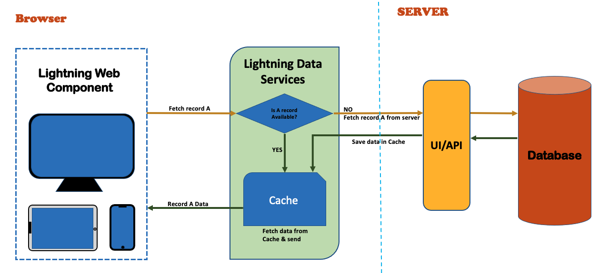

# **_<ins>Salesfoce LWC</ins>_**

---

- [Salesforce Org](#salesforce-org)
  - [Dev Org](#dev-hub)
  - [Scratch Org](#scratch-org)
- [LifeCycle Hooks](#lwc-lifecycle)
  - [render()](#render-method)

---

## **_<ins>Salesforce Org</ins>_**

    A deployment of Salesforce with a defined set of licensed users. An organization is the virtual space provided to an individual customer of Salesforce. Your organization includes all of your data and applications, and is separate from all other organizations.

**_Types of org_**
There are two broad categories of org:

    - Production instances
    - Development instances

> **_NOTE:_** Check here for more details (https://docs.gearset.com/en/articles/2285301-salesforce-organizations)

### Dev Hub

    It is main Salesforce org that you will use to create and manage your scratch orgs.

### Scratch Org

    It is a source-driven and disposable deployment of Salesforce code and metadata. Scratch Org are driven by source, Sandboxes are copies of production

- Scratch orgs have a maximum 30 days lifespan.
- You can select a duration from 1 through 30 days at the time of creation, with the default set at 7 days.
- After the scratch org has expired, you can’t restore it.

  > **_NOTE:_** Deleting a scratch org doesn’t terminate your scratch org subscription. If your subscription is still active, you can create a new scratch org. Creating a new scratch org counts against your daily and active scratch org limits.

[reference to check active scratch org in Salesforce](https://help.salesforce.com/s/articleView?id=sf.sfdx_dev_scratch_orgs_view_lex.htm&type=5)

---

## **_<ins>LWC Lifecycle<ins>_**


So main three lifecycle methods are

1.  **_constructor()_**:

    - This is invoked when a component instance is created.
    - have to call **_super()_** first inside this.
    - this flow from **<ins>parent to child<ins>**,
    - Don't add attributes to the host element in constructor.

2.  **_connectedCallback()_**:

    - Called when the element is inserted into a dcument.
    - this flow from **<ins>parent to child<ins>**:
    - you can't access child element in the component body as they don't exist yet.
    - we can access the host elemnt with this.template,
    - use is to : Perform intialization task, such as fetch data, set up caches or listen to events.
    - Do not use to : to change the sate of a component such as loading values or setting properties, Use setter & getter instead.

3.  **_renderCallback()_**:
    - Fires when a component rendering is done.
    - It can fire more than once.
    - this hook flows from **<ins>child to parent<ins>**.
    - When a component re-renders, all the expression used in the templete are re-evaluated.

> **_NOTE:_** _To change the state or update property of a component_. Don't upadte a wire adapter configuration object property in renderCallback(), as it can result in an infinite loop.

4. **_disconnectedCallback()_**:

   It gets invoked automatically when the corresponding web component gets removed from DOM.
   If we need to perform any logic when the component is removed from DOM, that logic can be added in disconnectedCallback().

   - This hook flows from **<ins>Parent to child<ins>**.
   - We use this lifecyle hook to purge caches or removing event listeners that are created on _connectedCallback()_.

5. **_errorCallBack(err,stack)_**

   - This method is is unique to Lightning Web Components. Implement it to create an error boundary component that captures errors in all the **descendent components** in its tree.
   - It captures errors that occur in the descendant's lifecycle hooks or during an event handler declared in an HTML template.
   - the **err** argument is a javaScript native error object, and the **stack** argument is a string.

### **_render() Method_**:

- **if:true/if;false** is recommend whenever there is small template to hide and show.
- wherever we have two design in same compoment but do not want to mix the HTML in one file.
- recommecned when we have conditional rendering of a component which have multiple HTML files.

---

## **_<ins> Component Communication<ins>_**

Component communication can can happen in two way.

- Parent component to Child component
- Child Component to Parent component

1. ### Component Communication from Parent to Child

   A. Parent calling child public property.

   `<c-child-component child-public-property="dataPassed">`

   B. Parent calling Child public method.

   `this.template.querySelector('c-child-component').publicMethod()`

2. ### Component communication from child to parent

   **_CustomEvent()_**

   A. Child calling Parent method

   `via DispatchEvent from child component`

   ```
   /**child component.html*/
    <template>
        <button title="Call Parent" onclick={childMethod}>
    </tempate>


    /**childComponent.js*/
    childMethod(){
        const callParent = new CustomEvent('childeventname', {data:object/property});
        this.dispatchEvent(callParent);
    }

    /**parentComponent.html*/

    <tempalate>
        <div>
            <c-child-component onchildeventname={childMethodHandler}>
        </div>
    </template>

    /**parenrComponent.js*/
    childMethodHandler(event){
        <!- do something->
        const dataFromChild = event.data;
    }
   ```

   > **_NOTE:_** the child event name alwas be in smallcase and will be called in parent html with prefix 'on'.<br>
   > Like above _'childevntname'_ will be called as _'onchildeventname'_

3. ### Event Bubbling

   _This is JavaScript concept_

   Event Bubbling is a concept in the DOM (Document Object Model). It happens when an element receives an event,
   and that event bubbles up (or you can say is transmitted or propagated) to its parent and ancestor elements in
   the DOM tree until it gets to the root element.

4. ### Publish & Subscribe (pubsub)

   _This is the JavaScript concept_

   In a publish-subscribe (pubsub) pattern, one component publishes an event. Other components subscribe to receive and handle the event. Every component that subscribes to the event receives the event. The pubsub module restricts events to a single page

   - It has one class/component which has only JavaScript file that defines the pubsub (publish, subscribe and unsubscribe) methods.
   - One component implements publish method.
   - Another components implements subscribe/unsubscribe.

   > **_NOTE_**: In containers that don’t support Lightning Messaging Service, use the pubsub module.

---

---

## **_<ins>Getters & Setters in LWC<ins>_**

    When a lightning web component receives data, there are two basic operations that are performed - reacting and storing. For simple use cases, you declare an @api property and it accepts the data passed in. However, you can execute logic each time a public property(@api) is set when using a custom setter for the property

    If you are passing a string or an object into a component without having to do any modification or normalizing on the properties. Declaring the property with @api annotation covers this scenario, the @api annotation exposes the property as public.

> Example

```
    /** parentComponent.html */
    <template>
        <!-- Call our component and pass the person object -->
        <c-getters-and-setters-example person={personObject}></c-getters-and-setters-example>
    </template>
    }

    /** parentComponent.js */
    import {LightningElement} from 'lwc';

    export default class ParentComponent extends LightningElement {
        //Sample person object
        personObject = {
            Name:"John doe",
            Age:55
        }
    }

    /** childComponent.html*/
    <!-- Getters And Setters Example -->
    <template>
    <!-- Use Slds styling -->
        <div class="slds-grid slds-grid_align-center">
            <!-- Use lightning card as extra styling -->
            <lightning-card title="Person Details" icon-name="standard:contact" class="slds-col slds-size_2-of-12">
                <!-- Display Person Details -->
                <ul class="slds-m-around_large">
                    <li style={personObject.Style}>Name: {personObject.Name}</li>
                    <li>Age: {personObject.Age}</li>
                </ul>
            </lightning-card>
        </div>
    </template>

    /** childComponent.js */
    import {LightningElement, api} from 'lwc';
    export default class GettersAndSettersExample extends LightningElement {

    _personObject;
    //Public property
    @api
    get person(){
        return this._personObject;
    }
    //setter method to modify the public propeerty/object
    set person(value){
        let tempObject = {
            //Use a spread operator
            ...value,
            //Make name upperCase
            Name: value.Name.toUpperCase(),
            //Add a new field to store some CSS to make the background light blue
            Style : 'background:lightblue'
        };

        //Set personObject property to our new updated person object
        this._personObject = tempObject;
    }

```

> **NOTE**:Objects that are passed to components are Read Only, therefore we cannot modify teh objects directly.<br>
> To mutate/modify it we need to create a shallow copy of the object and then modify it.<br>
> We can use sread oprator (...object, field:newValue) to make shallow copy

[Reference for the getter & Setter](https://www.levelupsalesforce.com/lwc-getters-and-setters#:~:text=Using%20getters%20and%20setters%20in,with%20a%20light%20blue%20background)

---

---

## **_<ins>SLOTS in LWC<ins>_**

    When you want to send markup (maybe some HTML code or HTML markup with predefined slds class names) from parent component to child component this is where slots in LWC are used.<br>
    So the point is, use properties to send data from parent to child components and use slots to send markup from parent to child component.

```
/** childComponent.html */
    <template>
        <h1>Child component</h1>
        <div>
            <slot></slot>
        </div>
    </template>

/** parentComponent.html */
    <template>
        <h1>parent header</h1>
        <c-child-component>
            <p>markup from parent</p>
        </c-child-component>
    </template>
```

**There are two types of slots**

- _Unnamed Slot_ -
- _Names Slot_ -

---

---

## **_<ins>Toast Notification LWC<ins>_**

- A component can send a toast notification that pops up to alert users of a success, error, or warning. A toast can also simply provide information.

- To display a toast notification in Lightning Experience or Experience Builder sites, import **ShowToastEvent** from the **'lightning/platformShowToastEvent'** module.

```
import { LightningElement } from 'lwc';
import {ShowToastEvent} from 'lightning/platformShowToastEvent'
export default class Notifications extends LightningElement {

    toastHandler(){

    showToast(title, message, variant){
        const event = new ShowToastEvent({
            title: "Toast Title",
            message: "Message Body",
            variant: "variant",
            messageData: data,
            mode:'mode'
        })
        this.dispatchEvent(event)
    }
}
```

## [Check here for more detail](https://developer.salesforce.com/docs/component-library/documentation/en/lwc/use_toast)

---

---

## **_<ins>Navigation in LWC<ins>_**

For navigation in LWC will utilize the below modules which is _'NavigationMixing'_ from _'lightning/navigation'_.

**Step 1:** import the _'NavigationMixing'_ from _'lightning/navigation'_.

```
   import {NavigationMixin} from 'lightning/navigation';
```

**Step 2:** extent the class to NavigationMixing(LightningElement)

```
   export default class MyLwcClass extends NavigationMixin(LightningElement) {}
```

**Step 3:**

```
  navigationHandler(){
       this.[NavigationMixin.Navigation]({
           type: 'type_of_navigation',
           attributes: {
               recordId:
               apiName:
               ObjectApiName:
               actionName:
           },
           state:{

           }
       })
  }
```

---

---

## **_<ins> Lightning Data Service<ins>_**

LightningWebService_diagram



1. Lightning Data Service is a centralized data caching framework and it is built on top of User Interface API.
2. UI API gives you data and metadata in a single response and also response and also respect CRUD access, field-level secirity settings, and sharings.
3. LDS displays only records and fields for which users have CRUD access and FLS vivibility.
4. LDS, Invakidates cache entry when salesforce data and metadata changes.
5. Optimizez server calls.
