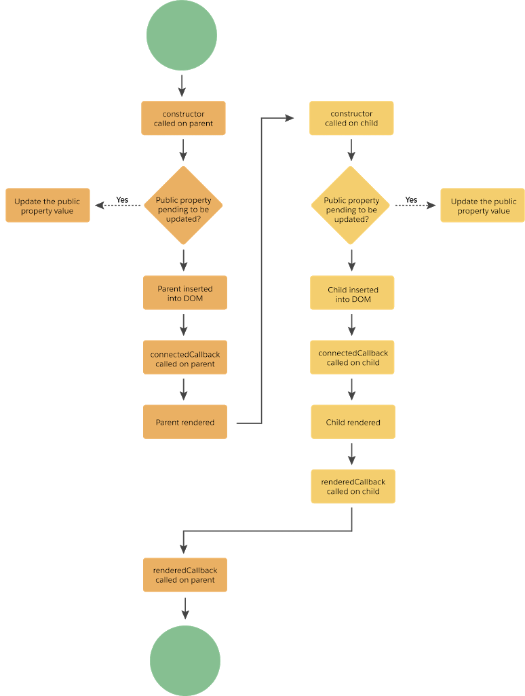

# **_<ins>Salesfoce LWC</ins>_**

---

## **_<ins>DevHub vs Scratch org</ins>_**

### **Dev Hub**

    It is main Salesforce org that you will use to create and manage your scratch orgs.

### **Scratch Org**

    It is a source-driven and disposable deployment of Salesforce code and metadata. Scratch Org are driven by source, Sandboxes are copies of production

- Scratch orgs have a maximum 30 days lifespan.
- You can select a duration from 1 through 30 days at the time of creation, with the default set at 7 days.
- After the scratch org has expired, you can’t restore it.

  > **_NOTE:_** Deleting a scratch org doesn’t terminate your scratch org subscription. If your subscription is still active, you can create a new scratch org. Creating a new scratch org counts against your daily and active scratch org limits.

[reference to check active scratch org in Salesforce](https://help.salesforce.com/s/articleView?id=sf.sfdx_dev_scratch_orgs_view_lex.htm&type=5)

---

## _LWC Lifecycle_

    So main three lifecycle methods are
    1. constructor(),
        This is invoked when a component instance is created.
    2. connectedCallback(),

    3. renderCallback().
